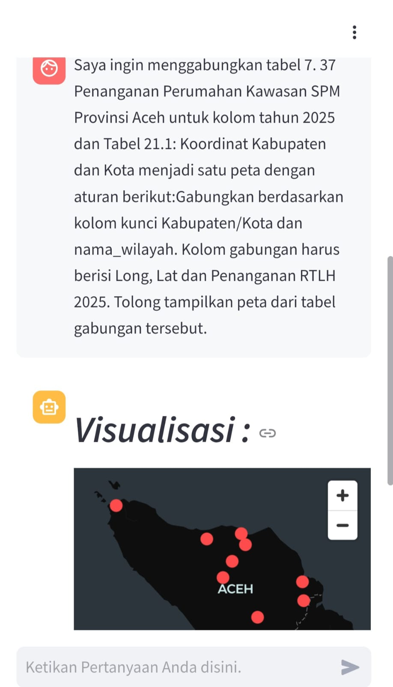
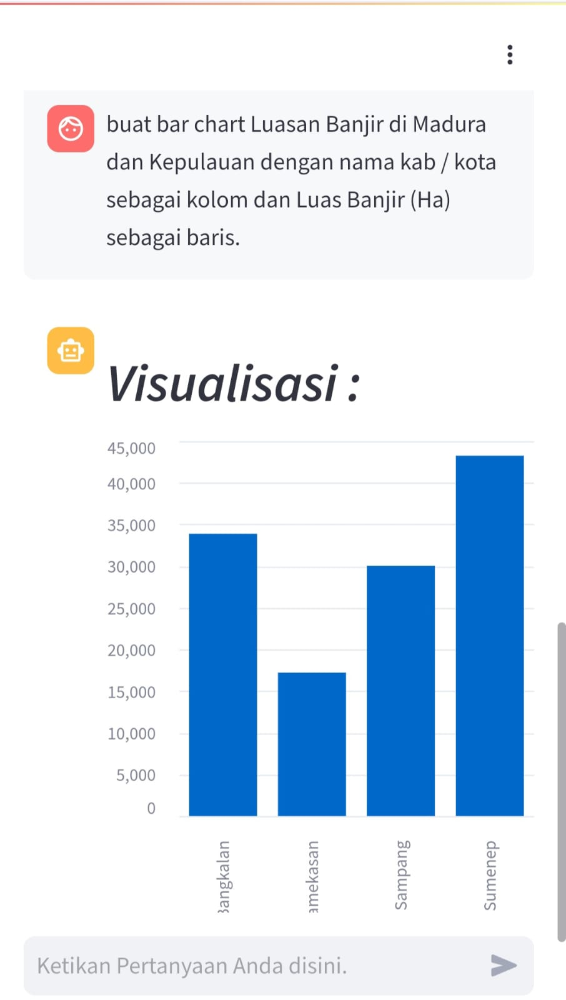
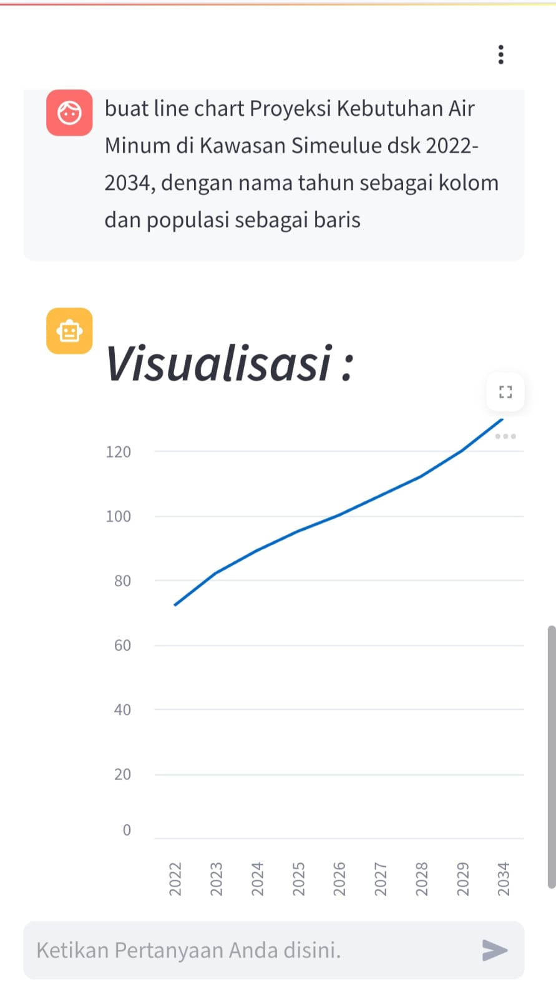

# Description
Membuat Chatbot AI yang responsif yang bisa menampilkan Text, Chart dan Peta terkait dokumen Rencana Pengembangan Infrastruktur Wilayah dan Dokumen Perencanaan Infrastruktur Wilayah Lainnya. Link https://bpiw.pu.go.id/AI

# Instalation 

`git clone`

`python -m venv RPIW-AI/`

`cd RPIW-AI\`

`source bin/activate`

`pip install -r requirements.txt`

`streamlit run 2_streamlit.py `

# Screenshot

  
  
  
  
  

